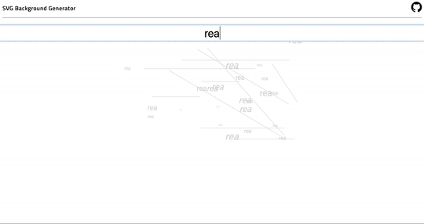

# SVG Background Generator

Actually just a simple front-end web app to generate cool-looking text and lines based on comma-separated input.



## Installing

Clone to your directory.

```
git clone https://github.com/ohsyln/svg-background
```

Install dependencies

```
npm install
```

## Start Client

npm start

## Built With

* [create-react-app](https://github.com/facebook/create-react-app) - web framework

## License

This project is licensed under the MIT License - see the [LICENSE](LICENSE) file for details
